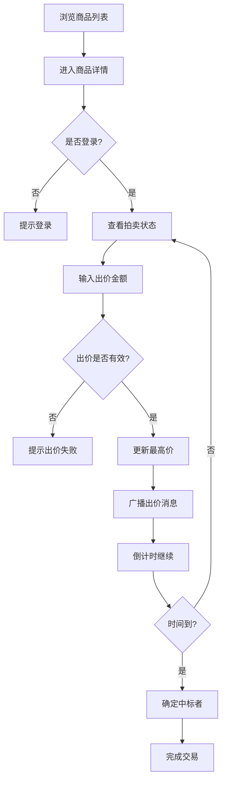

## 1. 产品概述

基于竞价模式的二手商品拍卖交易平台，实现商品倒计时竞拍和实时出价广播功能。后端极度轻量化，仅负责数据存储和同步，前端承担复杂交互逻辑。

- 主要目的：提供高效、透明的二手商品拍卖交易体验
- 解决问题：传统二手交易价格不透明、议价效率低
- 目标用户：有闲置物品出售需求的卖家和寻找性价比商品的买家
- 市场价值：通过拍卖机制实现商品价值最大化，提升交易效率

## 2. 核心功能

### 2.1 用户角色

| 角色 | 注册方式 | 核心权限 |
|------|----------|----------|
| 卖家 | 手机号注册 | 发布拍卖商品、查看拍卖状态、确认成交 |
| 买家 | 手机号注册 | 浏览商品、参与竞拍、查看出价历史 |
| 游客 | 无需注册 | 浏览商品列表、查看拍卖详情 |

### 2.2 功能模块

1. **首页**：拍卖商品列表、热门拍卖、即将结束
2. **商品详情页**：倒计时器、出价面板、出价历史曲线、商品信息
3. **用户中心**：我的拍卖、我参与的竞拍、个人信息
4. **发布拍卖页**：商品信息填写、起拍价设置、拍卖时长选择

### 2.3 页面详情

| 页面名称 | 模块名称 | 功能描述 |
|----------|----------|----------|
| 首页 | 商品列表 | 卡片式展示拍卖商品，显示当前最高价、剩余时间 |
| 商品详情页 | 倒计时组件 | 本地校准防抖，精确显示剩余时间 |
| 商品详情页 | 出价面板 | 快速出价、自定义出价、实时更新 |
| 商品详情页 | 出价历史曲线 | Canvas绘制价格走势曲线 |
| 商品详情页 | 消息弹窗 | 出价成功、被超越、拍卖结束等通知 |
| 发布拍卖页 | 商品表单 | 上传图片、填写描述、设置起拍价和时长 |
| 用户中心 | 拍卖管理 | 查看发布的拍卖、管理拍卖状态 |

## 3. 核心流程

### 3.1 竞拍流程

1. 用户浏览拍卖商品列表，选择感兴趣的商品
2. 进入商品详情页，查看商品信息和当前竞拍状态
3. 点击出价按钮，输入出价金额（需高于当前最高价）
4. 系统验证出价有效性，更新最高价
5. 实时广播出价消息给所有查看该商品的用户
6. 拍卖倒计时结束，最高出价者获得商品
7. 买卖双方进入交易流程

### 3.2 流程图

## 4. 用户界面设计

### 4.1 设计风格

- **主色调**：深青色 (#0D9488) - 代表信任和专业
- **辅助色**：琥珀色 (#F59E0B) - 用于强调和倒计时警示
- **背景色**：深灰色 (#0F172A) - 深色主题，突出商品
- **卡片背景**：半透明深色 (#1E293B) - 营造层次感
- **按钮风格**：圆角 8px，渐变背景，hover时有轻微放大效果
- **字体**：标题使用 'Noto Sans SC' 粗体，正文使用 'Inter' 常规
- **布局风格**：卡片式布局，悬浮效果，玻璃拟态风格
- **图标风格**：线性图标，统一 24px 尺寸

### 4.2 页面设计概述

| 页面名称 | 模块名称 | UI 元素 |
|----------|----------|---------|
| 首页 | 商品列表 | 网格布局、悬停动画、剩余时间实时更新 |
| 商品详情页 | 倒计时器 | 大号数字显示、颜色渐变（时间越近越红）、脉冲动画 |
| 商品详情页 | 出价面板 | 固定在右侧、快捷出价按钮、自定义输入框 |
| 商品详情页 | 历史曲线 | Canvas 绘制、平滑曲线、悬停显示详情 |
| 商品详情页 | 消息弹窗 | 右上角滑入、自动消失、不同状态不同颜色 |

### 4.3 响应式

- Desktop-first 设计，优先适配 1440px 宽度
- 平板端：调整网格列数，出价面板改为底部固定
- 移动端：单列布局，简化交互，触摸优化按钮尺寸
- 关键交互元素确保最小 48px 触摸区域

### 4.4 动效设计

- 页面加载：元素渐入 + 轻微上移动画
- 出价成功：按钮缩放 + 粒子扩散效果
- 倒计时最后 10 秒：数字脉冲动画 + 颜色变红
- 消息通知：从右侧滑入，停留 3 秒后淡出
- 卡片悬停：轻微上浮 + 阴影加深
