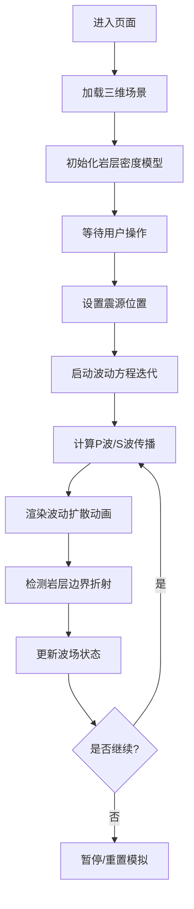

## 1. 产品概述

地质防震科普三维可视化平台，通过实时模拟地震波在不同岩层中的传播过程，帮助用户直观理解地震纵波(P波)和横波(S波)的物理特性、传播差异以及折射现象。

- 面向学生、地质爱好者和科普工作者，提供沉浸式的地震波传播可视化教学工具
- 核心价值在于将抽象的波动方程转化为直观可交互的三维动态演示

## 2. 核心功能

### 2.1 用户角色

| 角色 | 注册方式 | 核心权限 |
|------|----------|----------|
| 普通用户 | 无需注册 | 浏览三维场景、调整模拟参数、控制动画播放 |

### 2.2 功能模块

1. **主场景页面**：三维地块可视化、地震波实时传播动画、透视效果展示
2. **控制面板**：波动参数调节、岩层密度配置、波源位置设置
3. **信息展示区**：纵波/横波速度实时显示、波动方程说明、科普知识面板

### 2.3 页面详情

| 页面名称 | 模块名称 | 功能描述 |
|----------|----------|----------|
| 主场景页面 | 三维地块渲染 | 展示多层不同密度岩石构成的地下结构，支持透视视角 |
| 主场景页面 | 地震波模拟 | 基于自定义波动方程解算器，实时计算并渲染P波和S波的扩散、折射过程 |
| 主场景页面 | 交互控制 | 鼠标拖拽旋转视角、滚轮缩放、点击设置断层破裂点 |
| 控制面板 | 参数调节 | 调整震源强度、岩层密度、波速比例、模拟速度等参数 |
| 控制面板 | 预设场景 | 提供多种地质构造预设（均质岩层、分层岩层、断层构造等） |
| 信息展示区 | 科普面板 | 显示P波/S波传播原理、波动方程说明、防震知识 |

## 3. 核心流程

用户进入页面 → 自动加载三维地块模型和初始岩层配置 → 点击"启动模拟"按钮或点击地块设置震源 → 波动方程解算器开始迭代计算 → 实时渲染P波和S波在岩层中的传播、折射过程 → 用户可随时调整参数观察不同条件下的波动行为 → 可暂停/重置模拟

## 4. 用户界面设计

### 4.1 设计风格
- **主色调**：深蓝(#0a1628)作为背景，代表地下深邃感；橙色(#ff6b35)标识P波；青色(#00d4ff)标识S波
- **视觉风格**：科技感+地质主题，半透明材质展现岩层结构，发光效果突出波前
- **字体**：标题使用Orbitron（科技感等宽字体），正文使用JetBrains Mono，确保技术内容清晰易读
- **布局**：全屏三维场景为主，控制面板悬浮于右侧，信息面板位于底部
- **交互元素**：霓虹风格按钮，玻璃态(Glassmorphism)控制面板，带有科技感边框

### 4.2 页面设计概述

| 页面名称 | 模块名称 | UI元素 |
|----------|----------|--------|
| 主场景页面 | 三维场景 | 多层半透明立方体构成地块，颜色根据密度渐变，波前使用发光材质，支持透视切割效果 |
| 主场景页面 | 控制面板 | 右侧悬浮玻璃态面板，包含滑块、按钮、下拉选择器，带有柔和发光边框 |
| 主场景页面 | 信息面板 | 底部半透明条带，显示实时波速、传播时间、当前波前位置等数据 |
| 主场景页面 | 科普面板 | 可展开侧边栏，包含波动方程公式、P波/S波原理说明、防震小贴士 |

### 4.3 响应式设计
- 桌面端优先设计，确保1920×1080及以上分辨率最佳体验
- 平板端自适应调整控制面板尺寸和位置
- 移动端简化交互，提供预设场景快速切换

### 4.4 3D场景指导
- **环境**：深色太空背景，模拟地下环境，使用雾效增强深度感
- **光照**：环境光+方向光基础照明，P波使用橙色点光源跟随，S波使用青色点光源跟随
- **相机**：透视相机，初始45度俯视角，支持OrbitControls轨道控制
- **动画**：波前扩散使用帧动画，岩层边界使用高亮线条，折射点使用粒子效果
- **后期处理**：Bloom泛光效果增强波前发光感，轻微晕影聚焦视觉中心
- **性能**：使用WebGL渲染，波动计算在独立WebWorker中进行，确保60fps流畅度
