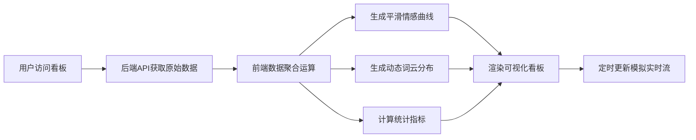

## 1. 产品概述

社交媒体突发事件舆情情感走向分析监控后台，为舆情分析师和决策者提供实时的社交媒体情感趋势分析。系统采用前后端分离架构，后端负责从离线数仓提取原始数据，前端承担高性能数据聚合运算与可视化渲染。

- **核心价值**：帮助用户快速把握突发事件的舆情走向，识别情感波动拐点，辅助决策
- **目标用户**：舆情分析师、公关团队、企业决策者
- **技术特色**：前端高性能计算架构，海量数据实时聚合与平滑处理

## 2. 核心功能

### 2.1 用户角色
| 角色 | 登录方式 | 核心权限 |
|------|---------|---------|
| 舆情分析师 | 系统登录 | 查看看板、调整时间范围、导出分析报告 |
| 管理员 | 系统登录 | 全功能权限、数据源配置 |

### 2.2 功能模块
1. **实时数据看板**：情感趋势总览、核心指标展示、动态更新
2. **情感走向曲线**：平滑处理的情感极性时间序列图表
3. **动态词云图**：实时热点词汇分布与情感色彩映射
4. **数据聚合面板**：多维度统计指标、情感分布占比
5. **实时数据流**：模拟社交媒体新帖子实时涌入效果

### 2.3 页面详情
| 页面名称 | 模块名称 | 功能描述 |
|---------|---------|---------|
| 主监控看板 | 顶部指标栏 | 展示帖子总数、正面/负面/中性占比、情感指数、热度趋势 |
| 主监控看板 | 情感趋势曲线 | 多维度情感走向平滑曲线，支持时间范围切换 |
| 主监控看板 | 动态词云图 | 热点词汇动态分布，颜色映射情感极性 |
| 主监控看板 | 情感分布雷达 | 各维度情感占比雷达图 |
| 主监控看板 | 实时帖子流 | 滚动展示最新帖子及其情感标签 |

## 3. 核心流程

用户进入监控看板后，系统自动从后端获取原始帖子数据，前端执行高性能聚合运算，生成平滑曲线和词云分布，并以固定频率更新数据模拟实时效果。

## 4. 用户界面设计

### 4.1 设计风格
- **主色调**：深空蓝背景 (#0a1628) + 数据蓝 (#3b82f6) + 情感绿 (#10b981) + 情感红 (#ef4444)
- **辅助色**：中性灰 (#64748b) + 高亮金 (#f59e0b)
- **按钮风格**：圆角胶囊按钮，悬停发光效果
- **字体**：标题使用 Space Grotesk，数据展示使用 JetBrains Mono，正文字体使用 Noto Sans SC
- **布局风格**：深色科技风仪表盘，网格布局，玻璃拟态卡片，数据流动光效
- **图标**：Lucide 线性图标，配合发光动效

### 4.2 页面设计概述
| 页面名称 | 模块名称 | UI 元素 |
|---------|---------|---------|
| 主监控看板 | 顶部指标栏 | 大字号数据展示，渐变数字动画，趋势箭头指示器 |
| 主监控看板 | 情感趋势曲线 | ECharts 面积图，平滑曲线，渐变填充，多系列叠加 |
| 主监控看板 | 动态词云图 | ECharts wordCloud，动态位置更新，情感颜色映射 |
| 主监控看板 | 情感分布雷达 | ECharts radar 图，动态数据更新 |
| 主监控看板 | 实时帖子流 | 垂直滚动列表，新项入场动画，情感标签 |

### 4.3 响应式设计
- **桌面端优先**：1920px 及以上最佳展示
- **适配 1440px / 1024px**：自动调整网格布局
- **触控优化**：图表支持触控缩放，滚动流畅

### 4.4 动效设计
- 页面加载：元素错位淡入，数据从 0 滚动到目标值
- 实时更新：新数据点闪烁高亮，词云位置平滑过渡
- 悬停交互：卡片悬浮抬升，边框发光，数据详情气泡
- 背景：细微网格纹理 + 数据流动粒子背景
