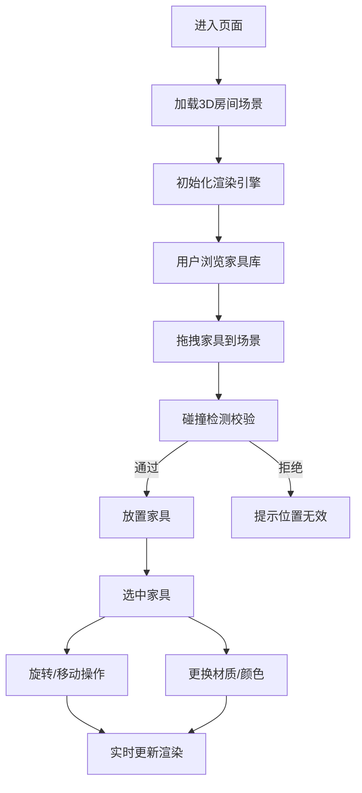

## 1. 产品概述

室内装修在线预览工具是一款基于WebGL的3D室内设计应用，用户可在虚拟房间内自由摆放家具、调整角度并更换材质，实时预览装修效果。所有复杂运算均在浏览器端完成，服务端仅提供静态资源。

- **核心价值**：让用户在装修前直观预览家具摆放效果，降低决策成本
- **目标用户**：室内设计师、装修业主、家居爱好者

## 2. 核心功能

### 2.1 用户角色
| 角色 | 注册方式 | 核心权限 |
|------|----------|----------|
| 访客用户 | 无需注册 | 使用所有3D预览功能 |

### 2.2 功能模块
1. **3D场景渲染**：空房间三维模型展示、实时光影效果
2. **家具库面板**：家具分类选择、拖拽放置
3. **交互操作**：家具选中、移动、旋转、删除
4. **材质替换**：布料纹理动态切换、颜色调整
5. **碰撞检测**：防止家具重叠、边界限制

### 2.3 页面详情
| 页面名称 | 模块名称 | 功能描述 |
|----------|----------|----------|
| 主界面 | 3D视口 | 房间全景展示，支持视角旋转缩放 |
| 主界面 | 左侧家具库 | 分类展示可放置的家具模型 |
| 主界面 | 右侧属性面板 | 选中家具的旋转、材质编辑 |
| 主界面 | 顶部工具栏 | 视图重置、场景清空等操作 |

## 3. 核心流程

## 4. 用户界面设计

### 4.1 设计风格
- **主色调**：深蓝色系 (#1e3a5f) 作为界面主色，传递专业感
- **辅助色**：暖橙色 (#ff6b35) 作为选中高亮和交互元素
- **中性色**：深灰到浅灰的渐变，营造现代简约氛围
- **按钮风格**：圆角矩形，悬浮时有微缩放和阴影变化
- **字体**：现代无衬线字体，标题使用 Geologica，正文使用 Inter
- **布局**：三栏式布局，左侧家具库、中间3D视口、右侧属性面板
- **图标风格**：线性图标，统一24px尺寸

### 4.2 页面设计概述
| 页面名称 | 模块名称 | UI元素 |
|----------|----------|--------|
| 主界面 | 3D视口 | 全屏Canvas、网格地面、柔和环境光 |
| 主界面 | 左侧面板 | 可折叠分类、家具卡片缩略图、拖拽指示器 |
| 主界面 | 右侧面板 | 滑杆控制器、颜色选择器、材质预设列表 |
| 主界面 | 顶部栏 | Logo、操作按钮组、帮助图标 |

### 4.3 响应性
- 桌面端为主，三栏固定布局
- 平板端：左右面板可折叠，使用图标菜单
- 触摸优化：家具拖拽支持触摸操作，旋转支持手势

### 4.4 3D场景指引
- **环境**：柔和的室内光环境，HDRI环境贴图提供真实反射
- **光照**：主方向光 + 环境光 + 补光，营造舒适室内氛围
- **相机**：透视相机，初始视角45度俯角，支持轨道控制
- **动画**：家具放置时有轻微弹跳动画，材质切换有过渡效果
- **后处理**：轻微泛光和抗锯齿，提升视觉质感
- **性能**：单场景面数控制在5万面以内，确保60fps
