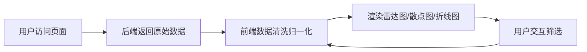

## 1. 产品概述
电子竞技选手赛后数据分析面板，用于汇聚和展示选手比赛数据，支持多维度数据可视化分析。
- 核心目的：为电竞分析师、教练和观众提供直观的选手数据对比工具
- 目标价值：通过数据可视化帮助发现选手优势与短板，辅助战术决策

## 2. 核心功能

### 2.1 功能模块
1. **数据概览面板**：选手列表、核心指标展示、数据筛选
2. **雷达图分析**：选手六维能力对比（击杀、生存、支援、经济、视野、控制）
3. **散点图分析**：双维度数据分布分析（如击杀vs死亡、经济vs输出）
4. **折线图趋势**：选手多场比赛表现趋势分析
5. **数据筛选器**：按比赛、位置、战队筛选选手

### 2.3 页面详情
| 页面名称 | 模块名称 | 功能描述 |
|-----------|-------------|---------------------|
| 主面板 | 选手列表 | 展示所有选手基础信息，支持搜索和排序 |
| 主面板 | 雷达图区域 | 多选手能力六边形对比，支持动态切换选手 |
| 主面板 | 散点图区域 | X/Y轴可配置维度，气泡大小代表第三维度 |
| 主面板 | 折线图区域 | 展示选手近N场比赛的关键指标趋势 |
| 主面板 | 数据筛选 | 比赛场次、选手位置、战队筛选 |

## 3. 核心流程
用户打开页面 → 系统加载模拟比赛数据 → 前端进行数据清洗和归一化 → 默认展示TOP5选手综合对比 → 用户可选择不同图表类型和筛选条件 → 图表实时更新展示

## 4. 用户界面设计

### 4.1 设计风格
- 主色调：深蓝科技感（#0A1628）配合霓虹青（#00F5D4）和电竞紫（#7C3AED）
- 按钮风格：圆角霓虹边框，悬停发光效果
- 字体：Orbitron（标题）+ JetBrains Mono（数据）+ Noto Sans SC（正文）
- 布局风格：暗黑科技风仪表盘，玻璃拟态卡片，网格布局
- 图标风格：线性科技图标，发光效果

### 4.2 页面设计概览
| 页面名称 | 模块名称 | UI 元素 |
|-----------|-------------|-------------|
| 主面板 | 顶部导航 | Logo、标题、全局筛选器 |
| 主面板 | 选手列表卡片 | 头像、ID、战队、位置标签、核心数据 |
| 主面板 | 雷达图卡片 | 六边形网格、多选手颜色区分、图例 |
| 主面板 | 散点图卡片 | 坐标轴、数据点气泡、工具提示 |
| 主面板 | 折线图卡片 | 时间轴、多条趋势线、数据点标记 |

### 4.3 响应式
- Desktop-first：1920px设计基准
- 平板：两列布局自适应
- 移动端：单列堆叠，图表可横向滚动

### 4.4 视觉动效
- 页面加载：卡片 staggered fade-in 动画
- 图表渲染：数据点从中心向外扩散动画
- 悬停效果：卡片轻微上浮、发光边框
- 数据切换：平滑过渡动画（500ms ease）
