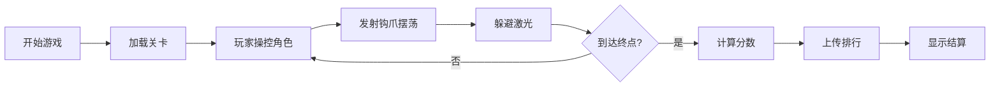

## 1. 产品概述
基于物理引擎的平台跳跃解谜游戏，玩家操控主角使用钩爪在悬浮平台间穿梭，躲避周期性激光障碍到达终点。

- 游戏类型：2D平台跳跃解谜
- 核心玩法：钩爪摆荡+平台跳跃+激光躲避
- 目标用户：休闲游戏玩家、物理引擎爱好者

## 2. 核心功能

### 2.1 功能模块
1. **游戏主场景**：物理引擎渲染、角色控制、平台碰撞
2. **钩爪系统**：发射钩爪、绳索物理、摆荡运动
3. **激光障碍**：周期性发射、碰撞检测、轨迹预测
4. **排行榜系统**：分数记录、排名展示、数据查询
5. **UI界面**：开始菜单、暂停菜单、结算界面

### 2.2 页面详情
| 页面名称 | 模块名称 | 功能描述 |
|-----------|-------------|---------------------|
| 主菜单 | 游戏入口 | 开始游戏、查看排行、操作说明 |
| 游戏场景 | 核心玩法 | 角色移动、钩爪发射、激光躲避 |
| 排行榜 | 数据展示 | 显示玩家分数排名 |
| 结算界面 | 结果展示 | 显示通关时间、分数、重新开始 |

## 3. 核心流程

## 4. 用户界面设计

### 4.1 设计风格
- **主色调**：深空蓝 #0a1628，霓虹青 #00f5ff，警示红 #ff3366
- **按钮风格**：霓虹发光边框、圆角12px、悬停放大效果
- **字体**：Orbitron（标题）、JetBrains Mono（正文）
- **布局**：游戏画布居中、UI元素悬浮在画布上方
- **视觉特效**：粒子系统、拖尾效果、屏幕震动

### 4.2 页面设计概览
| 页面名称 | 模块名称 | UI元素 |
|-----------|-------------|-------------|
| 主菜单 | 入口界面 | 霓虹标题、发光按钮、背景动画 |
| 游戏场景 | 游戏画面 | Canvas渲染、HUD分数显示、技能提示 |
| 排行榜 | 数据面板 | 玻璃拟态卡片、排名高亮、滚动列表 |
| 结算界面 | 结果展示 | 分数动画、粒子特效、操作按钮 |

### 4.3 响应性
- 桌面端：1280x720固定画布，自适应缩放
- 移动端：触控支持，虚拟摇杆按钮

### 4.4 游戏场景指导
- **环境**：赛博朋克风格、悬浮平台、霓虹灯光
- **光照**：深色背景+发光元素、对比度强烈
- **相机**：跟随角色平滑移动、适当缩放
- **特效**：钩爪绳索发光、激光警告闪烁、碰撞粒子
