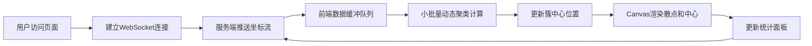

## 1. 产品概述

实时监控数据波动的动态聚类分析面板，通过WebSocket长连接接收服务端推送的二维坐标数据流，前端实时进行小批量动态聚类计算并可视化展示。

- 主要用途：实时数据分析与可视化监控
- 解决问题：传统离线聚类无法处理流式数据的实时分析需求
- 目标用户：数据分析师、运维监控人员、科研人员
- 核心价值：实时洞察数据流中的聚类模式变化

## 2. 核心特性

### 2.1 用户角色
| 角色 | 注册方式 | 核心权限 |
|------|----------|----------|
| 数据分析师 | 无需注册 | 查看实时聚类可视化、调整聚类参数 |

### 2.2 功能模块
1. **主面板**：实时聚类散点图、簇中心标记、统计信息
2. **控制面板**：聚类参数调整、数据速率控制、开始/暂停
3. **状态监控**：接收数据量、聚类数量、FPS显示

### 2.3 页面详情
| 页面名称 | 模块名称 | 功能描述 |
|---------|---------|----------|
| 主面板 | 散点图渲染 | Canvas实时绘制不同颜色聚类散点 |
| 主面板 | 簇中心标记 | 动态更新聚类中心位置，带连接线 |
| 控制面板 | 参数调节 | K值、学习率、批量大小调节 |
| 状态面板 | 实时统计 | 数据点数、聚类数、FPS、延迟显示 |

## 3. 核心流程

用户打开页面 → 建立WebSocket连接 → 服务端持续推送坐标数据 → 前端小批量缓存数据 → 动态聚类算法增量更新 → Canvas实时渲染聚类结果 → 统计信息实时更新

## 4. 用户界面设计

### 4.1 设计风格
- 主色调：深空蓝 (#0a1628) 背景，科技感赛博朋克风格
- 强调色：霓虹青 (#00f5ff)、霓虹粉 (#ff00ff)、霓虹黄 (#ffff00)、霓虹绿 (#00ff88)
- 字体：JetBrains Mono 等宽字体，营造数据分析控制台氛围
- 布局：左侧主画布，右侧垂直控制面板和状态面板
- 边框：发光霓虹边框效果，半透明玻璃态面板
- 动画：数据点入场闪烁、簇中心脉冲效果

### 4.2 页面设计总览
| 页面名称 | 模块名称 | UI元素 |
|---------|---------|--------|
| 主面板 | 散点图区域 | 深色背景、发光散点、动态簇中心、网格参考线 |
| 主面板 | 控制面板 | 滑块控件、数字输入、开关按钮、霓虹发光边框 |
| 主面板 | 状态面板 | 实时数字跳动、进度条、状态指示灯 |

### 4.3 响应式
- 桌面端优先设计，左右分栏布局
- 移动端自动转为上下布局，控制面板折叠展开

### 4.4 视觉特效
- Canvas网格线带呼吸动画
- 散点根据距离簇中心远近呈现不同透明度
- 簇中心有脉冲扩散效果
- 新数据点入场有淡入动画
- 面板边缘有霓虹发光效果
