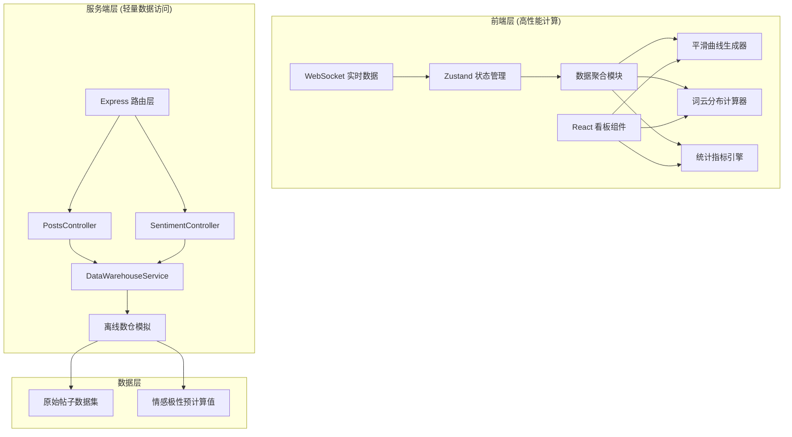
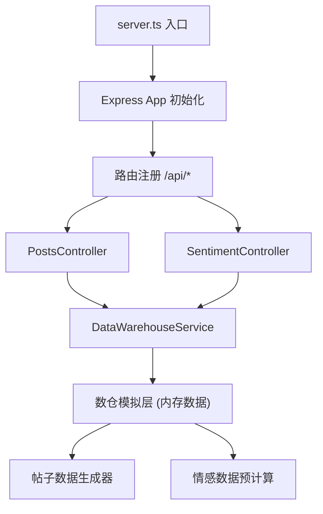

## 1. 架构设计



## 2. 技术描述

- **前端**：React@18 + TypeScript + Vite + TailwindCSS@3 + Zustand + ECharts + echarts-wordcloud
- **后端**：Express@4 + TypeScript + ESM
- **初始化工具**：vite-init (react-express-ts 模板)
- **数据层**：内存模拟离线数仓，包含 100,000+ 模拟帖子数据
- **前端计算**：所有聚合、平滑、词云运算均在浏览器端完成

## 3. 项目结构

```
├── src/                     # 前端源码
│   ├── components/          # React 组件
│   │   ├── dashboard/       # 看板组件
│   │   ├── charts/          # 图表组件
│   │   └── common/          # 通用组件
│   ├── hooks/               # 自定义 Hooks
│   ├── stores/              # Zustand 状态管理
│   ├── utils/               # 工具函数
│   │   ├── aggregation.ts   # 数据聚合算法
│   │   ├── smoothing.ts     # 曲线平滑算法
│   │   └── wordcloud.ts     # 词云计算逻辑
│   ├── pages/               # 页面组件
│   ├── services/            # API 服务
│   └── types/               # TypeScript 类型定义
├── api/                     # 后端源码
│   ├── controllers/         # 控制器层
│   │   ├── PostsController.ts
│   │   └── SentimentController.ts
│   ├── services/            # 服务层
│   │   └── DataWarehouseService.ts
│   ├── models/              # 数据模型
│   ├── routes/              # 路由定义
│   └── server.ts            # 服务入口
├── shared/                  # 前后端共享类型
└── data/                    # 模拟数仓数据
```

## 4. 路由定义

| 路由 | 用途 |
|-----|------|
| / | 主监控看板页面 |
| /api/posts/batch | 批量获取帖子数据 |
| /api/posts/stream | 获取实时新增帖子流 |
| /api/sentiment/batch | 批量获取情感极性值 |
| /api/health | 健康检查 |

## 5. API 定义

### 5.1 数据类型定义

```typescript
// shared/types.ts
export interface Post {
  id: string;
  content: string;
  timestamp: number;
  platform: 'weibo' | 'wechat' | 'douyin' | 'xiaohongshu' | 'bilibili';
  userId: string;
  likes: number;
  comments: number;
  shares: number;
}

export interface SentimentResult {
  postId: string;
  polarity: number; // -1 ~ 1, 负~正
  confidence: number; // 0 ~ 1
  emotions: {
    anger: number;
    joy: number;
    sadness: number;
    fear: number;
    surprise: number;
  };
  keywords: string[];
}

export interface PostWithSentiment extends Post {
  sentiment: SentimentResult;
}

export interface AggregatedData {
  timestamp: number;
  count: number;
  avgPolarity: number;
  positiveCount: number;
  negativeCount: number;
  neutralCount: number;
  keywords: Map<string, number>;
  platformDistribution: Record<string, number>;
}
```

### 5.2 API 接口

```typescript
// GET /api/posts/batch
interface GetPostsBatchRequest {
  startTime: number;
  endTime: number;
  limit?: number;
  offset?: number;
}

interface GetPostsBatchResponse {
  posts: Post[];
  total: number;
  hasMore: boolean;
}

// GET /api/sentiment/batch
interface GetSentimentBatchRequest {
  postIds: string[];
}

interface GetSentimentBatchResponse {
  sentiments: SentimentResult[];
}

// GET /api/posts/stream
interface GetPostsStreamResponse {
  posts: PostWithSentiment[];
  serverTime: number;
}
```

## 6. 服务端架构



## 7. 核心算法说明

### 7.1 前端数据聚合算法
- 时间窗口分桶：按 5 分钟、1 小时、1 天粒度聚合
- 加权平均：按热度（点赞+评论+分享）加权计算情感极性
- 滑动窗口：使用 3 点移动平均平滑曲线

### 7.2 曲线平滑算法
- Savitzky-Golay 滤波器：保留趋势的同时消除噪声
- 可选移动平均、指数平滑多种算法

### 7.3 词云动态分布
- TF-IDF 计算关键词权重
- 情感颜色映射：绿色正面、红色负面、灰色中性
- 力导向布局动态调整位置
