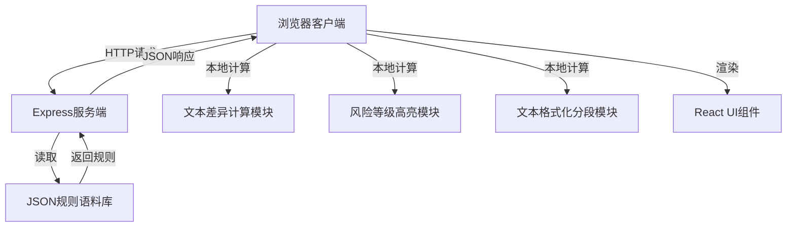
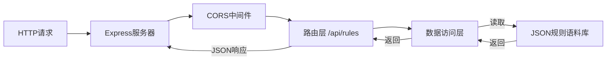

## 1. 架构设计

本系统采用"瘦服务端、胖客户端"的架构设计。服务端仅负责风险规则的存储与查询，所有复杂的文本处理逻辑全部在客户端完成，确保系统响应迅速且易于扩展。



## 2. 技术描述

- **前端**：React@18 + TypeScript + Vite@5 + TailwindCSS@3 + React Router@6
- **初始化工具**：npm create vite@latest
- **后端**：Express@4 + CORS
- **数据存储**：本地JSON文件作为规则语料库（无需数据库）
- **核心依赖**：
  - `diff`：文本差异计算
  - `react-router-dom`：路由管理
  - `lucide-react`：图标库

## 3. 项目结构

```
project-root/
├── client/                          # 前端项目
│   ├── src/
│   │   ├── router/                  # 路由模块（独立文件）
│   │   │   └── index.tsx
│   │   ├── core/                    # 核心业务模块（独立文件）
│   │   │   ├── textSegmenter.ts     # 长文本格式化分段
│   │   │   ├── textDiff.ts          # 文本差异计算
│   │   │   └── riskHighlighter.ts   # 多颜色风险等级高亮
│   │   ├── services/                # API服务
│   │   │   └── rulesApi.ts
│   │   ├── pages/                   # 页面组件
│   │   │   ├── UploadPage.tsx
│   │   │   ├── AnalysisPage.tsx
│   │   │   └── RulesPage.tsx
│   │   ├── components/              # 公共组件
│   │   │   ├── ContractViewer.tsx
│   │   │   ├── RiskPanel.tsx
│   │   │   └── RiskTooltip.tsx
│   │   ├── types/                   # 类型定义
│   │   │   └── index.ts
│   │   ├── App.tsx
│   │   └── main.tsx
│   └── package.json
├── server/                          # 后端项目
│   ├── data/
│   │   └── rules.json               # 规则语料库
│   ├── routes/
│   │   └── rules.js                 # 规则查询路由
│   ├── server.js                    # 服务入口
│   └── package.json
└── package.json                     # 根目录一键运行配置
```

## 4. 路由定义

| 路由 | 页面 | 用途 |
|------|------|------|
| / | 首页/合同上传页 | 上传合同文件、粘贴文本、配置分析选项 |
| /analysis | 风险分析页 | 展示分段合同、多颜色风险高亮、风险详情 |
| /rules | 规则库页 | 浏览风险规则库、查看规则详情 |

## 5. API 定义

### 5.1 类型定义

```typescript
// 风险等级
type RiskLevel = 'high' | 'medium' | 'low' | 'info';

// 风险规则
interface RiskRule {
  id: string;
  name: string;
  category: string;
  level: RiskLevel;
  description: string;
  patterns: string[];           // 匹配关键词或正则
  suggestion: string;           // 处置建议
  regulation?: string;         // 相关法规
}

// 匹配结果
interface RiskMatch {
  ruleId: string;
  rule: RiskRule;
  startIndex: number;
  endIndex: number;
  matchedText: string;
  segmentId: string;
}

// 合同分段
interface ContractSegment {
  id: string;
  type: 'title' | 'clause' | 'paragraph' | 'list';
  content: string;
  lineNumber: number;
  level?: number;
}

// API响应
interface RulesResponse {
  success: boolean;
  data: RiskRule[];
  timestamp: number;
}
```

### 5.2 接口定义

| 方法 | 路径 | 说明 | 请求参数 | 响应 |
|------|------|------|----------|------|
| GET | /api/rules | 获取所有风险规则 | category?: string, level?: string | RulesResponse |
| GET | /api/rules/:id | 获取单个规则详情 | id | { success: boolean, data: RiskRule } |
| GET | /api/rules/categories | 获取规则分类列表 | 无 | { success: boolean, data: string[] } |

## 6. 核心模块说明

### 6.1 文本格式化分段模块 (textSegmenter.ts)

**职责**：将原始合同文本按法律文书特点智能分段

**核心逻辑**：
- 识别标题层级（第X条、第X章、1.、1.1等）
- 识别条款边界（空行、特定开头词汇）
- 识别列表项
- 为每个分段生成唯一ID和行号
- 保留原始文本索引位置，便于后续高亮定位

### 6.2 文本差异计算模块 (textDiff.ts)

**职责**：将合同文本与标准模板/规则进行比对，识别差异

**核心逻辑**：
- 基于diff算法实现字级、词级、句级多粒度差异
- 计算新增、删除、修改的文本片段
- 支持与标准合同模板的差异比对
- 输出差异位置索引，供高亮模块使用

### 6.3 风险等级高亮模块 (riskHighlighter.ts)

**职责**：根据规则匹配结果，生成多颜色高亮渲染数据

**核心逻辑**：
- 多规则匹配冲突处理（重叠区域风险等级升级）
- 四级风险颜色映射：高(红)、中(橙)、低(黄)、提示(绿)
- 生成高亮区域的CSS样式配置
- 支持悬浮提示框位置计算
- 生成可点击的风险区域交互数据

## 7. 服务端架构

服务端采用极简设计，仅提供规则查询能力：



## 8. 数据模型

### 8.1 规则语料库结构 (rules.json)

```json
{
  "categories": ["违约责任", "保密条款", "知识产权", "争议解决", "付款条款", "生效终止"],
  "rules": [
    {
      "id": "R001",
      "name": "违约金比例过高",
      "category": "违约责任",
      "level": "high",
      "description": "合同约定的违约金比例超过法定上限，可能被法院调低",
      "patterns": ["违约金", "滞纳金", "每日", "0.5%", "1%", "百分之"],
      "suggestion": "建议将违约金比例调整为每日0.03%以内，或总计不超过合同金额的30%",
      "regulation": "《民法典》第五百八十五条"
    }
  ]
}
```

## 9. 一键运行配置

根目录 `package.json` 配置：
- `npm install`：同时安装前后端依赖
- `npm run dev`：并发启动前后端开发服务器
- `npm run build`：构建前端生产版本
- `npm start`：启动生产模式

使用 `concurrently` 实现前后端并发启动。
