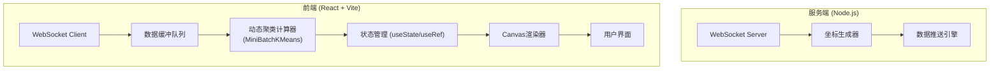
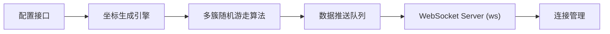

## 1. 架构设计



## 2. 技术说明

- 前端：React@18 + TypeScript + Vite@5 + TailwindCSS@3
- 服务端：Node.js + ws (WebSocket库)
- 构建工具：Vite
- 可视化：原生 Canvas 2D API
- 通信：WebSocket 长连接

## 3. 路由定义

| 路由 | 用途 |
|------|------|
| / | 主面板 - 实时聚类可视化 |

## 4. 核心类定义

### 4.1 动态聚类计算器 (DynamicClusterer)
```typescript
class DynamicClusterer {
  constructor(k: number, alpha: number, batchSize: number)
  update(points: Point[]): Cluster[]
  getCentroids(): Point[]
  getLabels(): number[]
}
```

### 4.2 Canvas渲染器 (ClusterRenderer)
```typescript
class ClusterRenderer {
  constructor(canvas: HTMLCanvasElement)
  render(points: Point[], labels: number[], centroids: Point[])
  clear()
  resize()
}
```

## 5. 服务端架构



## 6. 数据模型

### 6.1 数据结构定义

```typescript
// 二维坐标点
interface Point {
  x: number;
  y: number;
  id?: string;
  timestamp?: number;
}

// 聚类中心
interface Cluster {
  centroid: Point;
  count: number;
  label: number;
  color: string;
}

// WebSocket消息
interface WSMessage {
  type: 'data' | 'config' | 'status';
  payload: Point[] | Config;
}
```

### 6.2 聚类算法说明

采用增量式小批量K-Means算法：
1. 初始化K个随机簇中心
2. 每批数据到达时，分配到最近簇
3. 按学习率 α 更新簇中心：`centroid = centroid + α * (batch_mean - centroid)`
4. 支持动态调整学习率适应数据流变化
