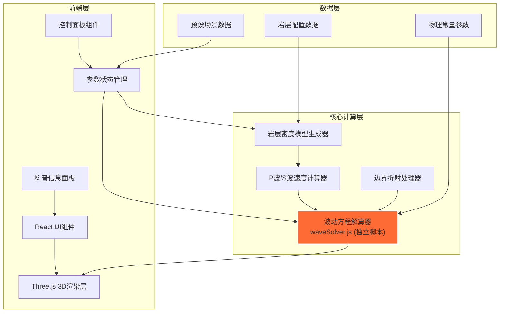

## 1. 架构设计



## 2. 技术说明

- **前端框架**：React@18 + Vite@5
- **3D渲染引擎**：three@0.160 + @react-three/fiber@8 + @react-three/drei@9
- **后期处理**：@react-three/postprocessing@2
- **样式方案**：tailwindcss@3
- **状态管理**：zustand@4（轻量级状态管理）
- **后端**：无，纯前端计算
- **数据库**：无，所有配置数据为静态JSON

### 关键技术决策：
1. **波动方程解算器独立封装**：在`src/utils/waveSolver.js`中实现纯JavaScript的有限差分波动方程迭代，不依赖任何外部库，确保算法清晰可控
2. **WebWorker计算**：波动计算在WebWorker中执行，避免阻塞主线程渲染
3. **Shader材质**：使用自定义ShaderMaterial实现波场的体积渲染效果，提升视觉表现力

## 3. 路由定义

| 路由 | 用途 |
|------|------|
| / | 主场景页面，包含三维可视化和所有控制面板 |

## 4. 数据模型

### 4.1 岩层配置数据结构

```typescript
interface RockLayer {
  id: string;
  name: string;
  depth: [number, number]; // 深度范围 [起始, 结束]
  density: number; // 密度 kg/m³
  pWaveVelocity: number; // P波速度 m/s
  sWaveVelocity: number; // S波速度 m/s
  color: string; // 显示颜色
}

interface EarthquakeSource {
  position: [number, number, number]; // 震源位置 (x, y, z)
  magnitude: number; // 震级 0-10
  startTime: number; // 起始时间
}

interface WaveSimulationParams {
  gridSize: [number, number, number]; // 计算网格尺寸
  timeStep: number; // 时间步长
  maxTime: number; // 最大模拟时间
  damping: number; // 阻尼系数 0-1
  boundaryCondition: 'reflective' | 'absorbing'; // 边界条件
}
```

### 4.2 波动方程核心算法

波动方程迭代解算器使用有限差分法求解三维弹性波方程：

```
∂²u/∂t² = (λ + 2μ)∇(∇·u) - μ∇×(∇×u) + f

其中：
- λ, μ 为拉梅常数（由岩层密度和波速计算）
- u 为位移矢量场
- f 为震源力项
```

分离P波和S波的计算：
- P波（纵波）：速度 Vp = √((λ + 2μ)/ρ)
- S波（横波）：速度 Vs = √(μ/ρ)

## 5. 核心模块文件结构

```
src/
├── utils/
│   └── waveSolver.js          # 波动方程迭代解算器（独立脚本）
├── components/
│   ├── EarthScene.jsx         # 三维场景主组件
│   ├── RockLayers.jsx         # 岩层模型组件
│   ├── WaveField.jsx          # 波场可视化组件
│   ├── ControlPanel.jsx       # 控制面板
│   ├── InfoPanel.jsx          # 信息展示面板
│   └── SciencePanel.jsx       # 科普知识面板
├── store/
│   └── useSimulationStore.js  # 模拟状态管理
├── data/
│   ├── rockLayers.js          # 岩层配置数据
│   └── presets.js             # 预设场景数据
├── workers/
│   └── waveWorker.js          # 波动计算WebWorker
├── App.jsx
├── main.jsx
└── index.css
```

### 5.1 waveSolver.js 核心接口

```javascript
// 初始化波场
export function createWaveField(gridSize, rockModel)

// 单步迭代计算
export function stepWaveField(waveField, params, dt)

// 获取P波位移场
export function getPWaveDisplacement(waveField)

// 获取S波位移场
export function getSWaveDisplacement(waveField)

// 设置震源
export function setSource(waveField, position, magnitude, time)

// 处理边界折射
export function processRefractions(waveField, rockModel)
```
