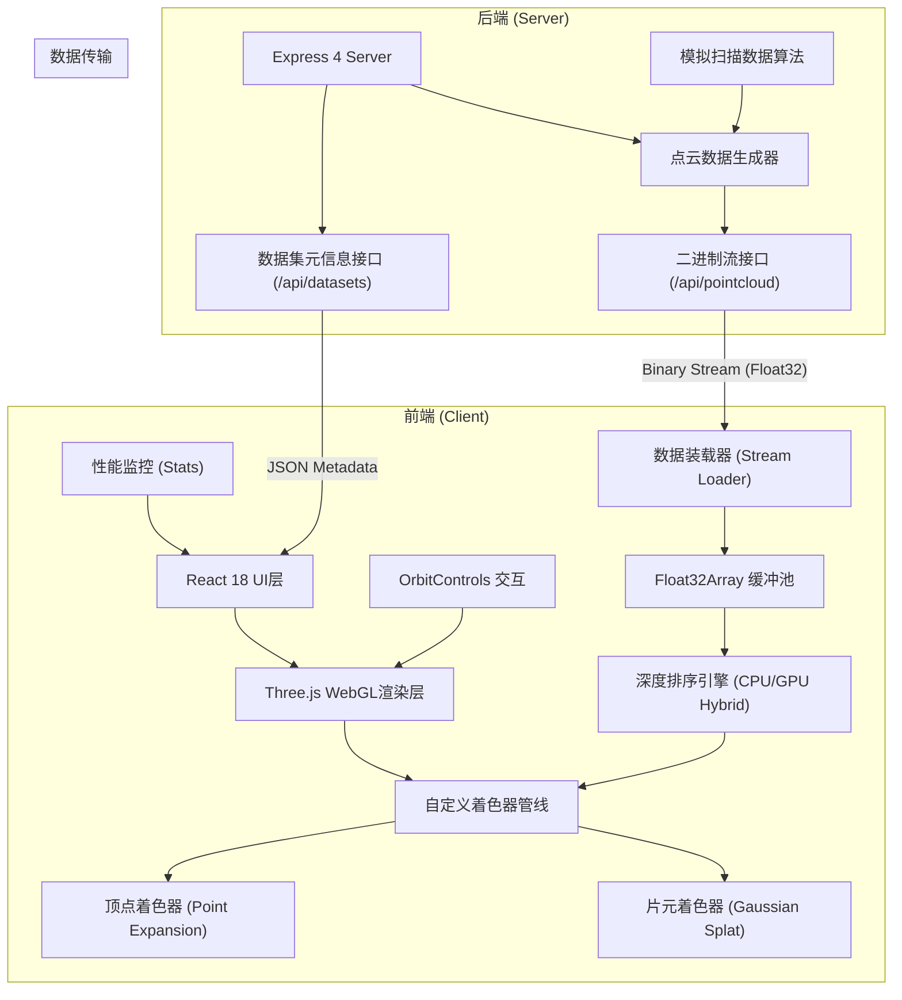
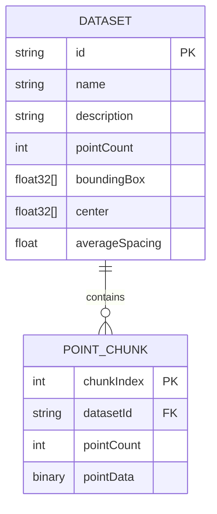
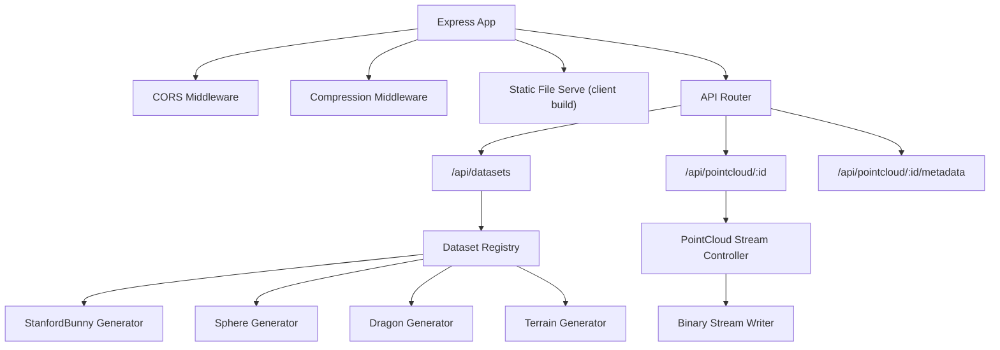

## 1. 架构设计



## 2. 技术栈说明

- **前端框架**: React 18 + TypeScript + Vite 5
- **3D引擎**: Three.js r160（直接使用WebGLRenderer，不使用React Three Fiber以获得最大性能控制）
- **着色器**: 原生GLSL 300 es，自定义ShaderMaterial
- **状态管理**: React useState/useRef，无需Redux（局部状态足够）
- **样式**: TailwindCSS 3 + CSS Variables
- **后端**: Express 4 + Node.js 20
- **数据格式**: 二进制Float32Array流式传输，每点占10个float（位置3 + 颜色3 + 法向3 + 大小1）
- **性能优化**: 
  - 内存池复用TypedArray
  - Web Worker进行深度排序
  - frustum culling视锥裁剪
  - LOD层级细节（距离降采样）

## 3. 目录结构

```
w:\ATraePro\5
├── client/                          # 前端项目
│   ├── src/
│   │   ├── components/              # React组件
│   │   │   ├── PointCloudCanvas.tsx # WebGL画布组件
│   │   │   ├── ControlPanel.tsx     # 控制面板
│   │   │   ├── PerformanceHUD.tsx   # 性能仪表盘
│   │   │   ├── DatasetSelector.tsx  # 数据集选择
│   │   │   └── LoadingBar.tsx       # 加载进度条
│   │   ├── rendering/               # 渲染管线（独立模块）
│   │   │   ├── PointCloudRenderer.ts # 主渲染器
│   │   │   ├── shaders/             # 着色器源码
│   │   │   │   ├── splat.vert.glsl  # 顶点着色器-点扩展
│   │   │   │   └── splat.frag.glsl  # 片元着色器-模糊圆斑
│   │   │   ├── DepthSorter.ts       # 深度排序引擎
│   │   │   └── TransparencyRenderer.ts # 半透明混合器
│   │   ├── loading/                 # 数据装载（独立模块）
│   │   │   ├── PointCloudLoader.ts  # 点云数据装载器
│   │   │   ├── BinaryStreamParser.ts # 二进制流解析
│   │   │   └── BufferPool.ts        # 缓冲池管理
│   │   ├── workers/                 # Web Workers
│   │   │   └── depthSort.worker.ts  # 深度排序Worker
│   │   ├── types/                   # 类型定义
│   │   ├── utils/                   # 工具函数
│   │   ├── App.tsx
│   │   └── main.tsx
│   ├── public/
│   ├── index.html
│   ├── vite.config.ts
│   └── package.json
│
├── server/                          # 后端项目
│   ├── src/
│   │   ├── index.ts                 # Express入口
│   │   ├── routes/
│   │   │   ├── pointcloud.ts        # 点云数据路由
│   │   │   └── datasets.ts          # 数据集路由
│   │   ├── generators/              # 点云数据生成器
│   │   │   ├── StanfordBunny.ts     # 斯坦福兔子（模拟）
│   │   │   ├── Sphere.ts            # 球体点云
│   │   │   ├── Dragon.ts            # 龙形点云
│   │   │   └── Terrain.ts           # 地形点云
│   │   └── utils/
│   └── package.json
│
└── .trae/
    └── documents/
        ├── prd.md
        └── architecture.md
```

## 4. 核心技术实现方案

### 4.1 自定义着色器实现点扩展

**顶点着色器 (splat.vert.glsl)**:
- 输入: position(xyz), color(rgb), normal(xyz), pointSize
- 输出: 面向相机的Billboard四边形的四个顶点
- 关键技术: `gl_PointSize` + 三角带扩展 + 视图空间变换
- 距离自适应: 点大小随距离平方衰减，但设置最小/最大阈值

**片元着色器 (splat.frag.glsl)**:
- 实现高斯衰减函数: `alpha = exp(-(u*u + v*v) / (2.0 * sigma * sigma))`
- Phong光照计算使用点云自带法向
-  discard alpha < 0.01 的像素减少overdraw
- 预乘Alpha解决半透明混合黑边问题

### 4.2 深度排序策略

**混合排序方案**:
1. **空间划分**: 八叉树(OcTree)预划分点云空间
2. **粗粒度排序**: CPU Worker对八叉树节点按深度排序
3. **细粒度排序**: 节点内点使用计数排序（利用深度值分布）
4. **增量更新**: 相机移动小于阈值时只执行局部重排
5. **排序周期**: 每两帧执行一次排序，插值过渡避免抖动

### 4.3 半透明混合管线

```
渲染顺序 (从远到近):
1. 关闭深度写入 gl.depthMask(false)
2. 开启混合 gl.enable(gl.BLEND)
3. 设置混合函数 gl.blendFuncSeparate(
       gl.ONE, gl.ONE_MINUS_SRC_ALPHA,  // RGB: 预乘Alpha混合
       gl.ONE, gl.ONE_MINUS_SRC_ALPHA   // Alpha: 累加
   )
4. 按深度从远到近绘制每个点
5. 最后绘制不透明UI元素
```

### 4.4 数据格式

```typescript
// 每个点 10 * 4 = 40 bytes
// 100万点 = 40MB, 300万点 = 120MB, 500万点 = 200MB
interface PointData {
  x: number; y: number; z: number;          // 位置 (3 floats)
  r: number; g: number; b: number;          // 颜色 (3 floats, 0-1)
  nx: number; ny: number; nz: number;       // 法向 (3 floats)
  size: number;                             // 点大小 (1 float)
}

// 二进制流格式: [totalPoints: u32][chunkSize: u32][pointData: Float32Array]...
```

## 5. API 定义

### 5.1 获取数据集列表

```typescript
// GET /api/datasets
interface DatasetInfo {
  id: string;
  name: string;
  description: string;
  pointCount: number;
  fileSize: string;
  previewUrl: string;
}

// Response: DatasetInfo[]
```

### 5.2 流式获取点云数据

```typescript
// GET /api/pointcloud/:datasetId?chunkSize=50000
// Accept: application/octet-stream
// 流式响应，Transfer-Encoding: chunked

// 每个chunk格式 (二进制):
// - 4 bytes: UInt32, chunkIndex
// - 4 bytes: UInt32, pointCountInChunk
// - pointCountInChunk * 40 bytes: PointData[]

// 客户端通过ReadableStream逐块解析
```

### 5.3 性能优化端点

```typescript
// GET /api/pointcloud/:datasetId/metadata
// 返回点云包围盒、中心、平均间距等元信息
interface PointCloudMetadata {
  pointCount: number;
  boundingBox: { min: [number, number, number]; max: [number, number, number] };
  center: [number, number, number];
  averagePointSpacing: number;
}
```

## 6. 性能目标与优化策略

| 指标 | 目标值 (100万点) | 目标值 (300万点) | 目标值 (500万点) |
|-----|-----------------|-----------------|-----------------|
| FPS | 60 | 45 | 30 |
| 帧时间 | <16ms | <22ms | <33ms |
| 排序时间 | <3ms | <5ms | <8ms |
| 显存占用 | <80MB | <200MB | <320MB |
| 内存占用 | <150MB | <400MB | <650MB |
| 加载时间 | <5s | <15s | <25s |

**关键优化**:
1. **顶点缓冲区复用**: 只创建一次BufferGeometry，按需更新subData
2. ** frustum culling**: CPU端预剔除视锥外的点
3. **距离降采样**: 远处点按距离平方概率丢弃
4. **Web Worker排序**: 不阻塞主线程渲染
5. **增量更新**: 数据分批上传GPU，避免卡顿
6. **WebGL2特性**: 使用VAO、Uniform Buffer Object等

## 7. 数据模型定义



## 8. 服务器架构


