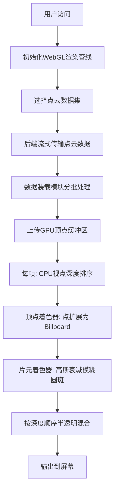

## 1. 产品概述

基于WebGL的高性能三维点云抛雪球体积渲染器，专为处理百万级带颜色和法向的离散点云数据设计，通过自定义着色器和精确的深度排序实现高质量半透明体积渲染效果。

- 核心目标：突破传统微小点元渲染的局限，通过抛雪球算法（splatting）将离散点扩展为有体积感的模糊圆斑，配合精确的深度排序和半透明混合，模拟出实体的质感
- 目标用户：三维扫描、逆向工程、医学影像、地质勘探等领域需要可视化大量点云数据的专业用户
- 市场价值：在浏览器端实现媲美桌面级软件的点云渲染质量，无需安装插件即可处理大规模扫描数据

## 2. 核心特性

### 2.1 功能模块

1. **点云渲染主页面**：WebGL渲染画布、交互控制面板、性能监控面板
2. **数据装载模块**：流式加载百万级点云数据，支持进度反馈
3. **渲染管线模块**：自定义顶点/片元着色器、深度排序器、透明度混合器
4. **交互控制模块**：轨道控制器、视角切换、渲染参数调节

### 2.2 页面详情

| 页面名称 | 模块名称 | 功能描述 |
|---------|---------|---------|
| 渲染主页面 | WebGL画布 | 全屏点云渲染区域，支持鼠标拖拽旋转、滚轮缩放、右键平移 |
| 渲染主页面 | 控制面板 | 调节点大小、衰减系数、透明度阈值等渲染参数 |
| 渲染主页面 | 性能面板 | 实时显示FPS、点数量、显存占用、排序耗时等指标 |
| 渲染主页面 | 数据加载区 | 选择点云数据集，显示加载进度条，支持暂停/继续 |

## 3. 核心流程

用户访问页面 → 初始化WebGL上下文和渲染管线 → 选择点云数据集 → 后端流式传输百万级点云数据（位置+颜色+法向） → 数据装载模块分批处理并上传GPU → 每帧根据相机位置执行CPU深度排序 → 着色器将每个点扩展为带衰减的模糊圆斑 → 按深度顺序执行半透明Alpha混合 → 呈现具有体积感的实体点云模型

## 4. 用户界面设计

### 4.1 设计风格

- **主色调**：深空灰 `#0a0e17` 背景 + 科技蓝 `#00d4ff` 强调色 + 警示橙 `#ff6b35` 性能警告
- **辅助色**：矩阵绿 `#00ff88` 数据正常 / 紫罗兰 `#a855f7` 选中状态
- **字体**：`JetBrains Mono` 作为等宽字体用于性能数据显示，`Space Grotesk` 作为界面标题字体
- **布局风格**：深色沉浸式设计，全屏画布 + 悬浮式控制面板 + 左上角性能仪表盘 + 底部加载进度条
- **视觉元素**：扫描线纹理、噪点叠加、CRT扫描效果、发光边框

### 4.2 页面设计概述

| 页面名称 | 模块名称 | UI元素 |
|---------|---------|---------|
| 渲染主页面 | WebGL画布 | 全屏深色背景，点云居中显示，带轻微暗角和扫描线效果 |
| 渲染主页面 | 性能仪表盘 | 左上角3x2网格布局，FPS/点数/显存/排序耗时/ draw call/帧时间，等宽字体，实时更新 |
| 渲染主页面 | 控制面板 | 右侧悬浮抽屉，可折叠，滑块控制参数，带数值输入框 |
| 渲染主页面 | 加载进度条 | 底部横向进度条，带百分比和已加载/总点数显示，科技感发光效果 |
| 渲染主页面 | 数据集选择 | 中央悬浮模态框，卡片式数据集列表，带预览缩略图和点数信息 |

### 4.3 响应式设计

- 桌面端优先：1920x1080及以上分辨率为主要目标
- 平板适配：控制面板转为底部抽屉，性能仪表盘改为可折叠
- 移动端：简化控制，只保留核心旋转缩放交互
- 触摸优化：支持双指缩放、单指旋转、双指平移

### 4.4 3D场景指导

- **环境氛围**：纯深空背景，无HDRI，突出点云本身的体积感
- **光照**：使用点云自带法向计算Phong光照，主光源随相机移动，环境光0.3
- **相机设置**：透视相机，fov 60度，近裁剪面0.1，远裁剪面10000，初始距离为点云包围球半径的2.5倍
- **相机动画**：加载完成后自动平滑推近到最佳观察距离，阻尼系数0.05
- **后处理**：胶片颗粒、轻微色差、暗角，增强科技感
- **性能预算**：单帧总耗时<16ms（60FPS），其中深度排序<5ms，渲染<10ms
