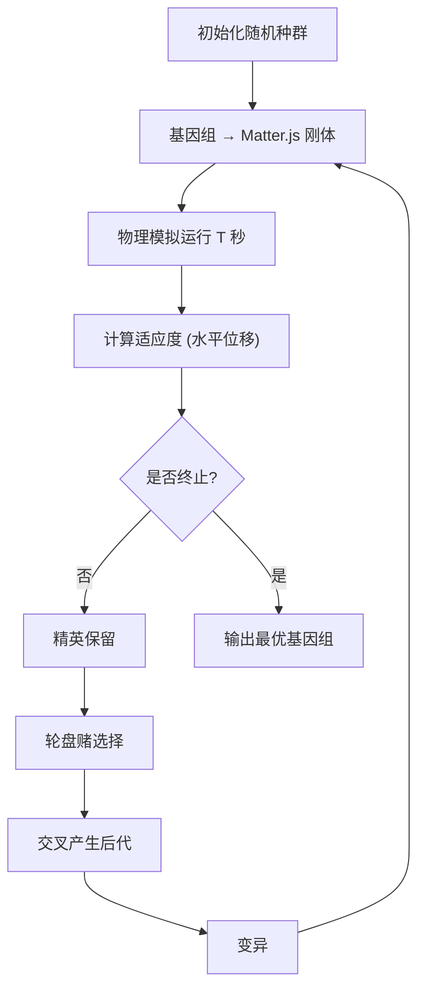

## 1. 产品概述

二维小车自动进化突变推演沙盒——纯前端运行的遗传算法物理模拟应用。用户观察随机生成的小车在起伏地形上奔跑，系统自动筛选跑得最远的个体，通过交叉变异产生下一代，直观展现进化压力如何塑造"车辆设计"。

- 目标：让用户零配置打开即玩，直观理解遗传算法的筛选、交叉与变异机制
- 目标用户：对进化算法、物理模拟、沙盒实验感兴趣的开发者与学生

## 2. 核心功能

### 2.1 功能模块

1. **模拟画布页面**：物理场景渲染、小车实时运行、地形生成、镜头跟踪
2. **控制面板**：种群参数配置、模拟启停、代际切换
3. **统计面板**：适应度曲线、当前代信息、最优个体追踪

### 2.2 页面详情

| 页面名称 | 模块名称 | 功能描述 |
|---------|---------|---------|
| 模拟画布 | 物理渲染区 | Canvas 实时渲染 Matter.js 刚体场景，含地形与小车，镜头自动跟随领先车辆 |
| 模拟画布 | 控制面板 | 种群大小、变异率、精英数量滑块；开始/暂停/重置按钮；当前代数与计时 |
| 模拟画布 | 统计面板 | 每代最优/平均适应度折线图、当前代个体适应度柱状图、历史最优基因组展示 |
| 模拟画布 | 小车详情 | 点击或悬浮某辆车，高亮显示其基因组详情（车体形状、轮径、轮位） |

## 3. 核心流程

1. 系统随机生成初始种群（N 辆随机形状+轮子的小车）
2. 将基因组转换为 Matter.js 刚体组合，放入起伏地形
3. 模拟运行固定时间（如 15 秒），计算每辆车的水平台移作为适应度
4. 选择适应度最高的个体作为精英直接保留
5. 对非精英个体进行轮盘赌选择 → 交叉 → 变异，生成下一代
6. 重复 2-5 直到用户停止

## 4. 用户界面设计

### 4.1 设计风格

- 主色调：深色工业风（#0a0e17 底色 + #00e5a0 霓虹绿强调色 + #ff6b35 橙色次要强调）
- 按钮风格：圆角微发光，霓虹边框
- 字体：JetBrains Mono（数据/代码区）+ Space Grotesk（UI 标题）
- 布局：左侧主画布 + 右侧可折叠控制/统计面板
- 图标风格：线性图标（Lucide）

### 4.2 页面设计概览

| 页面名称 | 模块名称 | UI 元素 |
|---------|---------|---------|
| 模拟画布 | 物理渲染区 | 全宽 Canvas，深色背景，霓虹网格线，小车彩色半透明车体+实心轮 |
| 模拟画布 | 控制面板 | 右侧侧栏，深色卡片，滑块+按钮，实时参数显示 |
| 模拟画布 | 统计面板 | 右侧侧栏下方，折线图+柱状图，霓虹配色 |
| 模拟画布 | 小车详情 | 悬浮卡片，基因组数值+微型预览图 |

### 4.3 响应式

桌面优先设计，Canvas 占据主要视口，右侧面板在窄屏时折叠为底部抽屉。

### 4.4 动效

- 小车运行时 Canvas 持续动画
- 代际切换时淡入淡出过渡
- 按钮悬浮发光效果
- 统计图表数据更新动画
