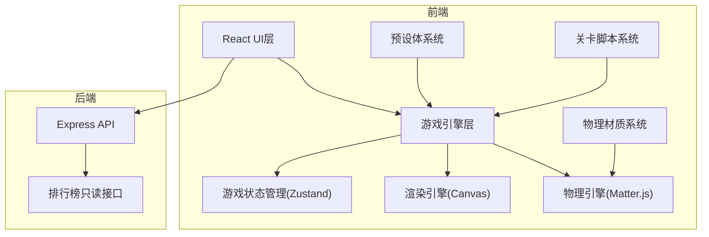

## 1. 架构设计



## 2. 技术描述
- **前端**: React@18 + TypeScript + Vite + TailwindCSS
- **物理引擎**: matter-js@0.19.0
- **状态管理**: zustand@4.4.0
- **后端**: Express@4.18.2 (轻量化排行接口)
- **初始化工具**: vite-init

## 3. 目录结构
```
src/
├── game/
│   ├── engine/          # 游戏引擎核心
│   ├── physics/         # 物理材质配置
│   ├── prefabs/         # 预设体定义
│   ├── levels/          # 关卡脚本
│   ├── entities/        # 游戏实体
│   └── systems/         # 游戏系统(钩爪、激光等)
├── components/          # React UI组件
├── store/               # Zustand状态管理
├── utils/               # 工具函数
└── pages/               # 页面组件

api/
└── index.ts             # Express后端入口
```

## 4. 路由定义
| 路由 | 用途 |
|-------|---------|
| / | 游戏主页面 |
| /leaderboard | 排行榜页面 |

## 5. API定义

### 5.1 排行榜接口

```typescript
// GET /api/leaderboard
interface LeaderboardResponse {
  success: boolean;
  data: Array<{
    id: string;
    playerName: string;
    score: number;
    time: number;
    level: number;
    createdAt: string;
  }>;
}

// POST /api/leaderboard
interface SubmitScoreRequest {
  playerName: string;
  score: number;
  time: number;
  level: number;
}
```

## 6. 核心系统设计

### 6.1 物理引擎封装
```typescript
interface PhysicsWorld {
  engine: Matter.Engine;
  world: Matter.World;
  addBody(body: Matter.Body): void;
  removeBody(body: Matter.Body): void;
  update(delta: number): void;
}
```

### 6.2 钩爪系统
```typescript
interface GrappleHook {
  isAttached: boolean;
  attachPoint: { x: number; y: number } | null;
  ropeLength: number;
  fire(targetX: number, targetY: number): void;
  release(): void;
  update(): void;
}
```

### 6.3 激光系统
```typescript
interface Laser {
  id: string;
  startPoint: { x: number; y: number };
  endPoint: { x: number; y: number };
  cycleTime: number;
  isActive: boolean;
  checkCollision(player: Player): boolean;
}
```

## 7. 预设体配置

### 7.1 平台预设体
- 普通平台: 静态刚体，标准物理材质
- 移动平台: 运动学刚体，周期移动
- 可破坏平台: 动态刚体，碰撞后销毁

### 7.2 物理材质
- 角色: 摩擦0.1，恢复0.2
- 平台: 摩擦0.8，恢复0.0
- 钩爪点: 摩擦1.0，恢复0.0
