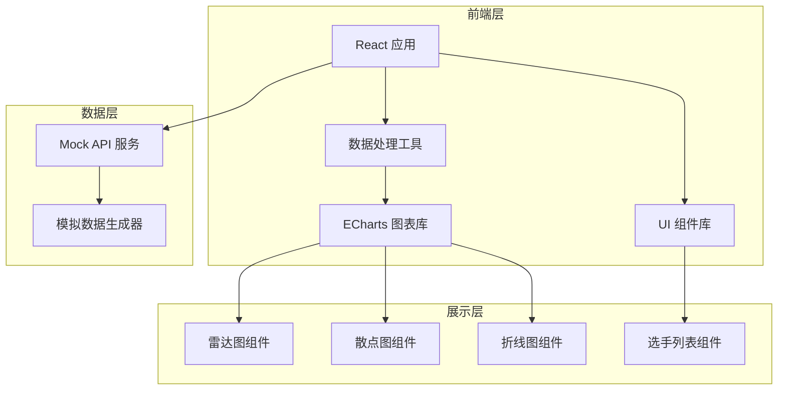
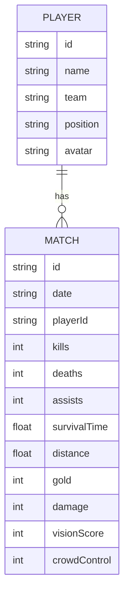

## 1. 架构设计



## 2. 技术描述
- 前端：React@18 + TypeScript + Vite@5
- 样式：TailwindCSS@3 + CSS Modules
- 图表库：ECharts@5
- 后端：Express@4（仅提供原始数据API）
- 数据：模拟数据生成脚本 + JSON文件存储
- 构建工具：npm scripts 一键启动

## 3. 目录结构
```
├── client/                 # 前端应用
│   ├── src/
│   │   ├── components/    # 组件
│   │   ├── utils/         # 数据清洗/归一化工具
│   │   ├── hooks/         # 自定义hooks
│   │   └── types/         # TypeScript类型
│   └── package.json
├── server/                # 后端服务
│   ├── index.js           # Express服务
│   ├── mock/              # 模拟数据
│   └── package.json
├── scripts/               # 数据生成脚本
│   └── generate-mock.js   # 假数据生成器
└── package.json           # 根目录scripts
```

## 4. 路由定义
| 路由 | 用途 |
|-------|---------|
| / | 主分析面板 |

## 5. API 定义

### 5.1 获取选手列表
```typescript
GET /api/players
Response: {
  players: Array<{
    id: string;
    name: string;
    team: string;
    position: 'top' | 'jungle' | 'mid' | 'adc' | 'support';
    avatar: string;
  }>
}
```

### 5.2 获取比赛记录
```typescript
GET /api/matches
Response: {
  matches: Array<{
    id: string;
    date: string;
    playerId: string;
    kills: number;
    deaths: number;
    assists: number;
    survivalTime: number;
    distance: number;
    gold: number;
    damage: number;
    visionScore: number;
    crowdControl: number;
  }>
}
```

## 6. 数据模型

### 6.1 数据模型定义


### 6.2 前端数据处理
- **归一化**：将各维度数据映射到 0-100 分制
- **清洗**：处理异常值、缺失值补全
- **聚合**：按选手/场次维度聚合统计
- **对比**：多选手数据归一化后横向对比

## 7. 启动脚本
```json
{
  "scripts": {
    "generate-mock": "node scripts/generate-mock.js",
    "dev:server": "cd server && npm install && npm start",
    "dev:client": "cd client && npm install && npm run dev",
    "setup": "npm run generate-mock && npm run dev:server & npm run dev:client",
    "start": "npm install && npm run generate-mock && concurrently \"npm run dev:server\" \"npm run dev:client\""
  }
}
```
