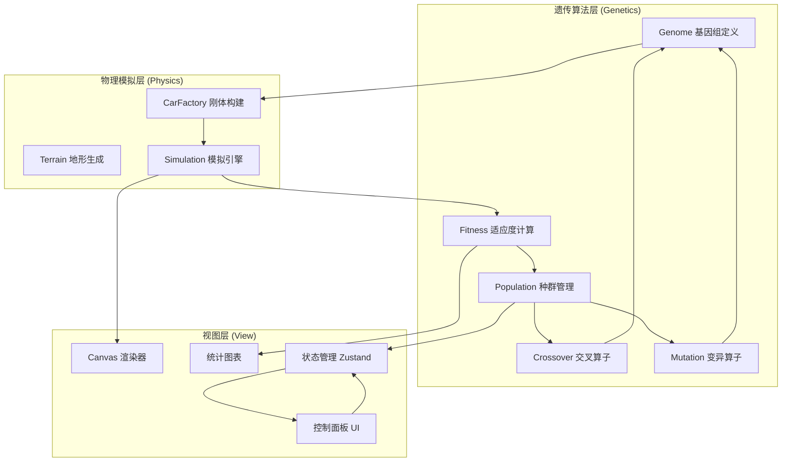

## 1. 架构设计

纯前端架构，无后端服务。遗传算法、物理模拟、视图三层彻底解耦。



## 2. 技术选型

- 前端框架：React 18 + TypeScript + Vite
- 样式：TailwindCSS 3
- 物理引擎：Matter.js 0.19+（2D 刚体物理）
- 状态管理：Zustand
- 图表：Canvas 自绘（无额外依赖）
- 初始化工具：vite-init (react-ts 模板)
- 后端：无

## 3. 路由定义

| 路由 | 用途 |
|-----|------|
| / | 主模拟页面，含画布、控制面板、统计面板 |

单页应用，无多余路由。

## 4. 核心数据结构

### 4.1 基因组 (Genome)

```typescript
interface WheelGene {
  radius: number;       // 轮半径 [8, 30]
  position: number;     // 轮在车体上的锚点位置比例 [0, 1]
  motorSpeed: number;   // 马达转速 [0.1, 0.8]
}

interface Genome {
  id: string;
  bodyVertices: { x: number; y: number }[];  // 车体多边形顶点 (6-10个)
  wheels: WheelGene[];                        // 2-3 个轮子
  density: number;           // 车体密度 [0.001, 0.005]
  friction: number;          // 车体摩擦力 [0.3, 1.0]
}
```

### 4.2 适应度 (Fitness)

```typescript
interface FitnessResult {
  genomeId: string;
  distance: number;     // 水平位移 (像素)
  maxHeight: number;    // 最大爬升高度
  survivalTime: number; // 存活时间 (ms)
  score: number;        // 综合得分 = distance + maxHeight * 0.3
}
```

### 4.3 种群状态 (Population State)

```typescript
interface PopulationState {
  generation: number;
  genomes: Genome[];
  fitnessResults: FitnessResult[];
  bestGenome: Genome | null;
  bestScore: number;
  history: { generation: number; bestScore: number; avgScore: number }[];
}
```

## 5. 模块职责与接口

### 5.1 遗传算法层 (`src/genetics/`)

| 模块 | 职责 | 关键接口 |
|------|------|---------|
| `genome.ts` | 基因组类型定义与随机生成 | `createRandomGenome()`, `cloneGenome()` |
| `fitness.ts` | 适应度计算（纯函数，仅依赖 FitnessInput） | `calculateFitness(input): FitnessResult` |
| `crossover.ts` | 交叉算子 | `crossover(parentA, parentB): [Genome, Genome]` |
| `mutation.ts` | 变异算子 | `mutate(genome, rate): Genome` |
| `population.ts` | 种群管理（选择、精英保留、代际推进） | `evolve(population, config): Population` |

### 5.2 物理模拟层 (`src/physics/`)

| 模块 | 职责 | 关键接口 |
|------|------|---------|
| `terrain.ts` | 地形生成（正弦叠加） | `generateTerrain(worldWidth): Body[]` |
| `carFactory.ts` | 基因组 → Matter.js 刚体 | `createCar(genome): CarBodies` |
| `simulation.ts` | 模拟运行与步进 | `Simulation.run()`, `Simulation.step()`, `Simulation.getStates()` |

### 5.3 视图层 (`src/components/` + `src/pages/`)

| 模块 | 职责 |
|------|------|
| `SimCanvas.tsx` | Canvas 渲染，镜头跟踪 |
| `ControlPanel.tsx` | 参数滑块、启停按钮 |
| `StatsPanel.tsx` | 适应度折线图、柱状图 |
| `CarDetail.tsx` | 个体基因组详情浮窗 |
| `Home.tsx` | 主页面布局 |

## 6. 关键算法细节

### 6.1 地形生成
使用多频正弦波叠加 + 随机扰动，生成起伏路。起点平坦（50px 平台），然后逐渐升高难度。

### 6.2 车体生成
随机生成 6-10 个极坐标点（角度均匀、半径随机），转为笛卡尔坐标形成凸包，作为车体多边形。轮子锚点均匀分布在车体底部。

### 6.3 选择策略
精英保留 + 轮盘赌选择。前 topK 直接保留，其余通过适应度比例概率选择。

### 6.4 交叉策略
均匀交叉：车体顶点数取父本，轮子数量取母本，每个基因位随机选父/母本。

### 6.5 变异策略
高斯扰动：对数值型基因添加 N(0, σ) 噪声，σ 与变异率正相关；结构型基因（顶点数、轮子数）以低概率增减。
