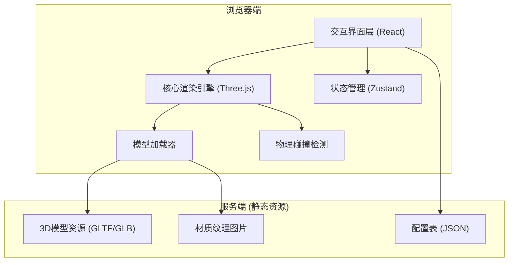

## 1. 架构设计



## 2. 技术描述

- **前端框架**：React@18 + TypeScript@5 + Vite@5
- **3D渲染**：Three.js@0.160 + @react-three/fiber@8 + @react-three/drei@9
- **状态管理**：Zustand@4
- **样式方案**：TailwindCSS@3
- **物理检测**：Three.js 内置 Raycaster + AABB 碰撞检测
- **服务端**：Express@4 (仅提供静态资源和配置接口)
- **模型格式**：GLTF/GLB (Draco压缩)

## 3. 模块划分

| 模块 | 目录 | 职责 |
|------|------|------|
| 核心渲染引擎 | `src/engine/` | Three.js场景初始化、光照、渲染循环 |
| 模型加载器 | `src/loaders/` | GLTF模型加载、材质预处理、资源缓存 |
| 交互界面 | `src/components/` | 家具库面板、属性面板、工具栏 |
| 3D组件 | `src/components/3d/` | 房间、家具、控制器等React Three Fiber组件 |
| 状态管理 | `src/store/` | 场景状态、选中物体、材质配置 |
| 工具函数 | `src/utils/` | 碰撞检测、数学计算、配置加载 |

## 4. 核心数据结构

### 4.1 家具配置
```typescript
interface FurnitureItem {
  id: string;
  name: string;
  category: 'sofa' | 'chair' | 'table' | 'bed' | 'decoration';
  modelUrl: string;
  defaultMaterial: MaterialConfig;
  availableMaterials: string[];
  boundingBox: { width: number; depth: number; height: number };
}

interface MaterialConfig {
  id: string;
  name: string;
  color?: string;
  mapUrl?: string;
  normalMapUrl?: string;
  roughness?: number;
  metalness?: number;
}
```

### 4.2 场景状态
```typescript
interface SceneState {
  placedItems: PlacedFurniture[];
  selectedItemId: string | null;
  cameraPosition: [number, number, number];
}

interface PlacedFurniture {
  instanceId: string;
  furnitureId: string;
  position: [number, number, number];
  rotation: [number, number, number];
  materialId: string;
}
```

## 5. 目录结构

```
src/
├── engine/
│   ├── SceneRenderer.tsx      # 核心渲染组件
│   ├── Lighting.tsx           # 光照配置
│   └── useRenderLoop.ts       # 渲染循环Hook
├── loaders/
│   ├── ModelLoader.ts         # GLTF模型加载器
│   └── TextureLoader.ts       # 材质纹理加载器
├── components/
│   ├── ui/                    # 基础UI组件
│   ├── panels/
│   │   ├── FurnitureLibrary.tsx   # 家具库面板
│   │   └── PropertiesPanel.tsx    # 属性面板
│   └── 3d/
│       ├── Room.tsx           # 房间模型
│       ├── Furniture.tsx      # 家具组件
│       └── Controls.tsx       # 交互控制器
├── store/
│   └── useSceneStore.ts       # 场景状态管理
├── utils/
│   ├── collision.ts           # 碰撞检测
│   └── config.ts              # 配置加载
└── pages/
    └── Index.tsx              # 主页面
```

## 6. API 定义 (服务端)

| 端点 | 方法 | 用途 |
|------|------|------|
| `/api/furniture` | GET | 获取家具配置列表 |
| `/api/materials` | GET | 获取材质配置列表 |
| `/assets/models/*` | GET | 3D模型静态资源 |
| `/assets/textures/*` | GET | 纹理图片静态资源 |

## 7. 性能优化策略

1. **模型优化**：使用Draco压缩的GLB格式，低多边形模型
2. **实例化渲染**：相同家具使用InstancedMesh减少Draw Call
3. **材质复用**：相同材质共享Material实例
4. **LOD策略**：远处物体使用低精度模型
5. **按需加载**：家具库滚动时懒加载模型预览
6. **碰撞优化**：使用AABB包围盒而非精确三角形检测
