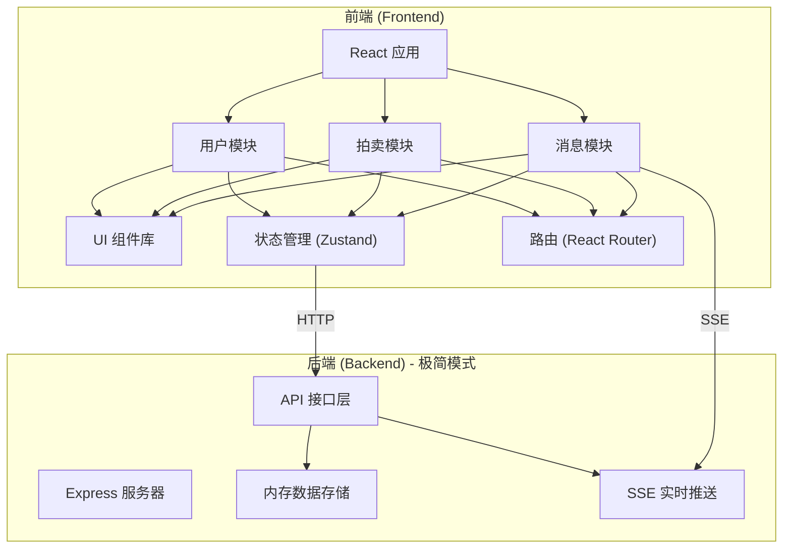

## 1. 架构设计



## 2. 技术描述

### 2.1 技术栈选择

- **前端框架**: React@18 + TypeScript
- **构建工具**: Vite@5
- **样式方案**: TailwindCSS@3
- **状态管理**: Zustand (轻量级)
- **路由**: React Router@6
- **图表绘制**: Canvas API (原生，无第三方库)
- **后端**: Express@4 (极简)
- **实时通信**: Server-Sent Events (SSE)
- **数据存储**: 内存存储 (演示用)

### 2.2 前后端职责划分

**后端职责 (极度压缩)**：
- 存储拍卖商品基本信息
- 维护当前最高价和出价时间戳
- 提供查询当前状态的 API
- 通过 SSE 广播出价事件
- 时间戳同步服务

**前端职责**：
- 倒计时器本地校准和防抖
- 出价历史曲线 Canvas 绘制
- 所有弹窗和交互逻辑
- 本地状态管理和乐观更新
- 出价验证和用户反馈

## 3. 模块划分

### 3.1 目录结构

```
src/
├── modules/
│   ├── user/           # 用户模块
│   │   ├── components/
│   │   ├── hooks/
│   │   └── store.ts
│   ├── auction/        # 拍卖模块
│   │   ├── components/
│   │   │   ├── CountdownTimer.tsx    # 倒计时组件（含校准防抖）
│   │   │   ├── BidPanel.tsx          # 出价面板
│   │   │   ├── PriceChart.tsx        # 价格曲线（Canvas）
│   │   │   └── AuctionCard.tsx
│   │   ├── hooks/
│   │   │   └── useAuction.ts
│   │   └── store.ts
│   └── message/        # 消息模块
│       ├── components/
│       │   └── Toast.tsx             # 弹窗组件
│       ├── hooks/
│       │   └── useSSE.ts             # SSE 连接
│       └── store.ts
├── shared/
│   ├── components/
│   ├── hooks/
│   └── utils/
├── pages/
├── App.tsx
└── main.tsx
```

## 4. 路由定义

| 路由 | 页面 | 功能 |
|------|------|------|
| `/` | 首页 | 拍卖商品列表展示 |
| `/auction/:id` | 拍卖详情页 | 商品详情、出价、倒计时 |
| `/publish` | 发布拍卖页 | 卖家发布新拍卖商品 |
| `/user` | 用户中心 | 个人信息、我的拍卖 |
| `/user/bids` | 我的竞拍 | 参与的竞拍记录 |

## 5. API 定义

### 5.1 TypeScript 类型定义

```typescript
// 商品信息
interface AuctionItem {
  id: string;
  title: string;
  description: string;
  images: string[];
  startPrice: number;
  currentPrice: number;
  startTime: number;
  endTime: number;
  sellerId: string;
  sellerName: string;
  bidCount: number;
}

// 出价记录
interface BidRecord {
  id: string;
  auctionId: string;
  userId: string;
  userName: string;
  price: number;
  timestamp: number;
}

// 用户信息
interface User {
  id: string;
  name: string;
  avatar: string;
}
```

### 5.2 后端 API

| 方法 | 路径 | 说明 | 响应 |
|------|------|------|------|
| GET | `/api/auctions` | 获取拍卖列表 | `AuctionItem[]` |
| GET | `/api/auction/:id` | 获取单个拍卖详情 | `AuctionItem` |
| GET | `/api/auction/:id/bids` | 获取出价历史 | `BidRecord[]` |
| POST | `/api/auction/:id/bid` | 提交出价 | `{ success: boolean, price: number, timestamp: number }` |
| POST | `/api/auction` | 创建拍卖 | `AuctionItem` |
| GET | `/api/time` | 获取服务器时间 | `{ timestamp: number }` |
| GET | `/api/stream` | SSE 事件流 | 实时出价事件 |

### 5.3 SSE 事件格式

```typescript
// 新出价事件
interface BidEvent {
  type: 'new_bid';
  data: {
    auctionId: string;
    price: number;
    userId: string;
    userName: string;
    timestamp: number;
  };
}

// 拍卖结束事件
interface AuctionEndEvent {
  type: 'auction_end';
  data: {
    auctionId: string;
    winnerId: string;
    winnerName: string;
    finalPrice: number;
  };
}
```

## 6. 核心技术实现

### 6.1 倒计时本地校准防抖

```typescript
// 核心逻辑：
// 1. 从服务器获取基准时间戳
// 2. 计算本地时间与服务器时间的偏差
// 3. 使用 requestAnimationFrame 精确倒计时
// 4. 防抖处理：防止频繁重绘
// 5. 页面可见性变化时重新校准
```

### 6.2 Canvas 价格曲线绘制

```typescript
// 核心逻辑：
// 1. 将出价记录转换为画布坐标
// 2. 使用贝塞尔曲线绘制平滑曲线
// 3. 实现悬停显示详情
// 4. 动画效果：曲线从左到右绘制
// 5. 响应式适配画布尺寸
```

### 6.3 前端状态管理

```typescript
// Zustand store 结构
interface AuctionStore {
  auctions: AuctionItem[];
  currentAuction: AuctionItem | null;
  bidHistory: BidRecord[];
  fetchAuctions: () => Promise<void>;
  placeBid: (auctionId: string, price: number) => Promise<boolean>;
}
```

## 7. 数据模型（内存存储）

### 7.1 数据结构

```javascript
// 内存数据库结构
const db = {
  auctions: new Map(),      // id -> AuctionItem
  bids: new Map(),         // auctionId -> BidRecord[]
  users: new Map(),        // id -> User
};
```

### 7.2 初始数据

系统启动时预置 5-8 个演示拍卖商品，包含不同类型（电子产品、家居、服饰等），每个商品预置 3-10 条出价记录，用于展示价格曲线。
