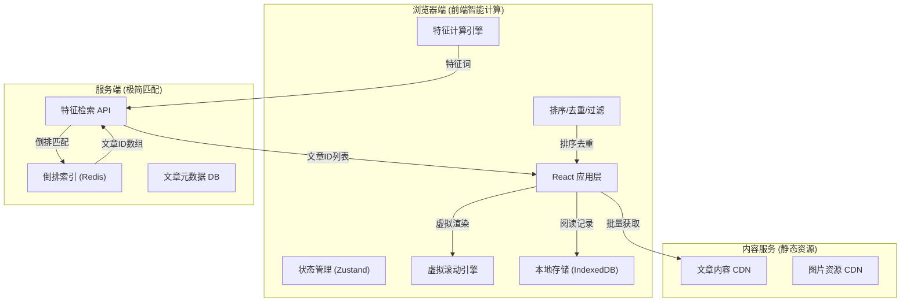
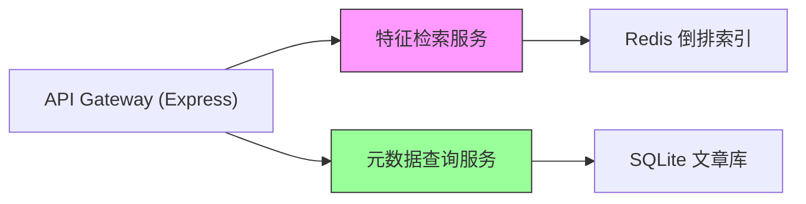
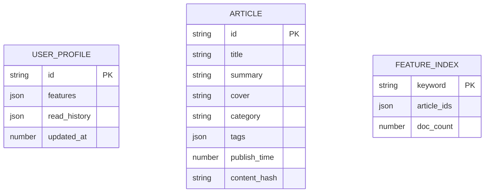

## 1. 架构设计

"后端极简、前端智能"的创新架构，服务端仅做特征匹配，前端承担所有业务逻辑。



## 2. 技术栈说明

- **前端框架**：React@18 + TypeScript + Vite
- **状态管理**：Zustand（轻量高效，支持持久化）
- **样式方案**：TailwindCSS@3 + CSS Variables
- **虚拟滚动**：react-window（高性能长列表）
- **本地存储**：IndexedDB + Dexie.js（大量数据存储）
- **HTTP客户端**：Axios + SWR（请求缓存+重试）
- **后端服务**：Express@4（极简API服务）
- **数据存储**：Redis（特征倒排索引）+ SQLite（文章元数据）

## 3. 路由定义

| 路由 | 页面用途 |
|------|----------|
| / | 新闻流主页（无限滚动推荐） |
| /article/:id | 新闻详情页 |
| /history | 浏览历史页 |
| /features | 特征管理页 |

## 4. API 接口定义

### 4.1 核心推荐接口

```typescript
// 请求：发送用户特征词
interface RecommendRequest {
  features: Array<{
    word: string;
    weight: number;
  }>;
  pageSize?: number;
  excludeIds?: string[]; // 已读文章ID，后端简单过滤
}

// 响应：仅返回文章ID列表
interface RecommendResponse {
  articleIds: string[];
  hasMore: boolean;
}
```

### 4.2 文章批量获取接口

```typescript
// 批量获取文章元数据
interface ArticlesRequest {
  ids: string[];
}

interface ArticleMeta {
  id: string;
  title: string;
  summary: string;
  cover: string;
  author: string;
  publishTime: number;
  category: string;
  tags: string[];
  readCount: number;
}

interface ArticlesResponse {
  articles: ArticleMeta[];
}
```

### 4.3 文章内容接口

```typescript
interface ArticleContent {
  id: string;
  content: string; // Markdown格式
  keywords: string[]; // 提取的关键词
}
```

## 5. 服务端架构

服务端采用极致简化设计，仅两个核心服务：



**特征检索服务职责**：
- 接收前端发送的特征词数组
- 在Redis倒排索引中查找匹配的文章ID
- 按权重简单聚合排序
- 返回文章ID列表（不含任何详情）

**元数据服务职责**：
- 根据ID批量查询文章基础信息
- 静态内容CDN分发
- 无任何业务逻辑

## 6. 前端核心模块

### 6.1 特征计算引擎

```typescript
interface UserProfile {
  features: Map<string, number>; // 关键词 -> 权重
  readHistory: Set<string>; // 已读文章ID
  categoryPreference: Map<string, number>;
}

// 特征提取算法
class FeatureExtractor {
  extractKeywords(content: string): string[];
  calculateWeight(readTime: number, scrollDepth: number): number;
  updateProfile(article: Article, behavior: Behavior): void;
}
```

### 6.2 新闻流处理器

```typescript
class NewsFeedEngine {
  // 时间线重新排序
  sortByRelevance(articles: Article[]): Article[];
  
  // 阅读历史去重
  dedupeByHistory(articles: Article[], history: Set<string>): Article[];
  
  // 多样性过滤
  ensureDiversity(articles: Article[]): Article[];
  
  // 虚拟滚动数据管理
  virtualize(list: Article[], viewport: Viewport): Article[];
}
```

### 6.3 数据模型


