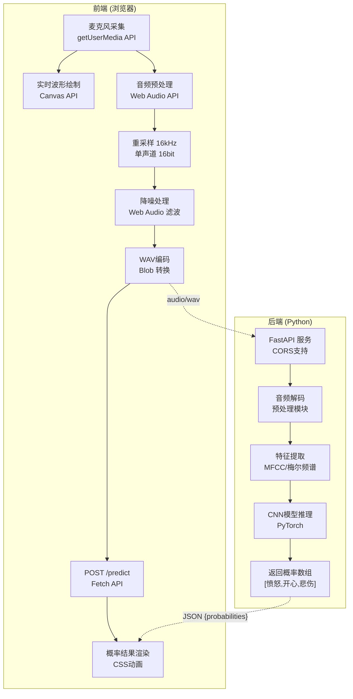

## 1. 架构设计

系统采用简化的前后端分离架构，严格遵循"后端只做推理，前端处理所有其他逻辑"的设计理念。



## 2. 技术描述

### 2.1 前端技术栈
- **语言**: 原生 HTML5 / CSS3 / JavaScript (ES6+)
- **音频处理**: Web Audio API, MediaRecorder API
- **可视化**: Canvas 2D API
- **HTTP请求**: Fetch API
- **无构建工具**：直接用浏览器打开或简单HTTP服务器

### 2.2 后端技术栈
- **语言**: Python 3.10+
- **Web框架**: FastAPI 0.100+
- **深度学习**: PyTorch 2.0+
- **音频处理**: librosa 0.10+, soundfile 0.12+
- **数值计算**: numpy, scipy
- **ASGI服务器**: uvicorn

### 2.3 项目目录结构
```
w:\ATraePro\3\
├── backend\
│   ├── model.py          # 模型定义（独立文件）
│   ├── preprocess.py     # 音频预处理（独立文件）
│   ├── server.py         # API服务（独立文件）
│   ├── model_weights\    # 模型权重目录
│   │   └── emotion_cnn.pt
│   └── requirements.txt  # 依赖清单
└── frontend\
    ├── index.html        # HTML页面
    ├── css\
    │   └── style.css     # 样式文件
    └── js\
        └── app.js        # 前端逻辑
```

### 2.4 模型架构
使用轻量级CNN模型，输入为梅尔频谱图 (128 x 128)，输出3类情绪概率。

## 3. 路由定义

| 路由 | 方法 | 用途 |
|------|------|------|
| `/` | GET | 静态页面服务（可选） |
| `/predict` | POST | 情绪识别推理API |
| `/health` | GET | 健康检查 |

## 4. API 定义

### 4.1 POST /predict
**请求体**: `multipart/form-data`
```
file: 音频文件 (WAV格式, 16kHz, 单声道)
```

**响应体**: `application/json`
```typescript
interface PredictResponse {
  success: boolean;
  probabilities: [number, number, number]; // [愤怒, 开心, 悲伤]
  emotion_labels: string[];                // ["愤怒", "开心", "悲伤"]
  inference_time_ms: number;
}
```

**示例响应**:
```json
{
  "success": true,
  "probabilities": [0.05, 0.82, 0.13],
  "emotion_labels": ["愤怒", "开心", "悲伤"],
  "inference_time_ms": 127
}
```

### 4.2 GET /health
**响应**:
```json
{
  "status": "ok",
  "model_loaded": true
}
```

## 5. 数据预处理规范

### 5.1 前端预处理
- 采样率：48kHz → 16kHz 重采样
- 声道：立体声 → 单声道
- 位深度：32位浮点数 → 16位PCM
- 降噪：高通滤波（80Hz截止）+ 简单噪声门限
- 格式：WAV容器，PCM编码

### 5.2 后端特征提取
- 梅尔频谱图：n_mels=128, n_fft=2048, hop_length=512
- 对数变换 + 归一化
- 固定长度：裁剪或补零到 ~3秒 (128 x 128)

## 6. 模型定义

```python
# model.py 核心结构
class EmotionCNN(nn.Module):
    Input: (batch, 1, 128, 128)  # 梅尔频谱图
    Conv2d(32, 3x3) → ReLU → MaxPool
    Conv2d(64, 3x3) → ReLU → MaxPool
    Conv2d(128, 3x3) → ReLU → MaxPool
    Flatten → Dropout(0.5)
    Linear(512) → ReLU → Dropout(0.3)
    Linear(3) → Softmax
    Output: [p_angry, p_happy, p_sad]
```

## 7. 启动方式

### 后端启动
```bash
cd backend
pip install -r requirements.txt
python server.py
```
服务端口：8000

### 前端启动
```bash
cd frontend
python -m http.server 8080
```
访问：http://localhost:8080

## 8. 跨域配置
后端已配置CORS，允许 `http://localhost:8080` 和 `http://127.0.0.1:8080` 访问。
